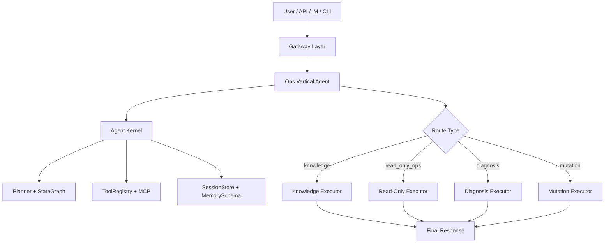

# OpsAgent

基于 LangChain + LangGraph 构建的 DevOps AI Agent。当前实现已经从“单一 ReAct agent”重构为“Agent Kernel + Vertical Agent”的分层架构：通用编排骨架进入 `agent_kernel/`，Ops 垂直逻辑进入 `agent_ops/`，覆盖知识问答、只读运维查询、故障诊断和受审批约束的变更入口。

## 当前状态

这是一个可运行的 PoC / MVP，不是完整的生产级运维平台。现在已经具备：

- `knowledge`：RAG-first 知识问答
- `read_only_ops`：K8s / Jenkins / 日志的只读查询
- `diagnosis`：受限 ReAct，多步取证诊断
- `mutation`：计划 + 审批门，当前主要支持 Jenkinsfile 生成和知识库索引
- `shared memory`：跨路由共享 `facts / observations / hypotheses / plans / execution`
- `audit`：基础审计日志记录
- `SSE`：流式输出 route、tool_call、tool_result、message、done 事件

当前还没有完全做实的部分：

- Redis / DB 持久化 session 和 audit
- 独立的 verification executor
- 真正的 K8s / Jenkins 写操作工具
- 完整的审批状态机
- 生产级 IM 适配能力

## 推荐架构

当前推荐架构采用“Kernel + Vertical Agent”的模式，而不是让所有请求都走统一 ReAct：

- `knowledge`：RAG-first，非 ReAct
- `read_only_ops`：确定性查询执行器
- `diagnosis`：受限 ReAct，限步取证
- `mutation`：计划 + 审批 + 执行骨架



当前主架构文档见 [docs/architecture-v2.md](./docs/architecture-v2.md)。  
历史演进和 route-first 细节见 [docs/architecture-deep-dive.md](./docs/architecture-deep-dive.md)。  
Shared memory schema 和 agent 权限矩阵见 [docs/shared-memory-design.md](./docs/shared-memory-design.md)。

## Shared Memory

系统现在会在 session 内维护分层共享记忆，用于把 `knowledge -> read_only_ops -> diagnosis` 串成连续流程。

- `facts`：高置信知识事实，例如 `env`、`namespace`、`service`
- `observations`：工具观察结果，例如 `last_pod_status`、`last_error_summary`
- `hypotheses`：诊断假设，例如 `likely_root_cause`
- `plans`：变更计划
- `execution`：执行结果
- `verification`：回读校验结果，当前还未完整接入

当前代码映射：

- `knowledge` 写 `facts`
- `read_only_ops` 写 `observations`
- `diagnosis` 写 `hypotheses`
- `mutation` 写 `plans / execution`

## 测试

当前测试分两层：

- `tests/test_agent.py`：Ops vertical 的功能回归
- `tests/kernel_contract/`：Kernel 框架契约，覆盖自定义 route / memory layer、审批门、实例隔离、动态 executor wiring

## 核心能力

| 路由 | 当前能力 | 典型工具 |
|------|----------|----------|
| `knowledge` | 环境信息、SOP、架构文档问答 | `query_knowledge` |
| `read_only_ops` | 查询 Pod / Deployment / Service / Jenkins / Logs | `get_pod_status`, `query_jenkins_build`, `search_logs` |
| `diagnosis` | 多步排障、结合状态和日志输出结论 | `diagnose_pod`, `get_pod_logs`, `query_knowledge` |
| `mutation` | Jenkinsfile 生成、知识库索引、审批门骨架 | `generate_jenkinsfile`, `index_documents` |

## 快速开始

### 1. 环境准备

```bash
python -m venv venv
source venv/bin/activate
pip install -e ".[dev]"
```

要求：

- Python `>= 3.11`
- 如需知识库问答，需要本地可用的 embedding 模型下载能力

### 2. 配置

```bash
cp .env.example .env
```

至少配置一组可用的 LLM 凭据：

```bash
# OpenAI
LLM_PROVIDER=openai
LLM_MODEL=gpt-4o
OPENAI_API_KEY=sk-xxx

# Router 使用轻量模型
ROUTER_LLM_PROVIDER=openai
ROUTER_LLM_MODEL=gpt-4o-mini

# DeepSeek
LLM_PROVIDER=deepseek
LLM_MODEL=deepseek-chat
OPENAI_API_KEY=sk-xxx
OPENAI_BASE_URL=https://api.deepseek.com/v1

# Anthropic
LLM_PROVIDER=anthropic
LLM_MODEL=claude-sonnet-4-20250514
ANTHROPIC_API_KEY=sk-ant-xxx
```

常用配置项：

- `K8S_ALLOWED_NAMESPACES`
- `K8S_READONLY_NAMESPACES`
- `CHROMA_PERSIST_DIR`
- `REDIS_URL`
- `SERVER_HOST`
- `SERVER_PORT`

### 3. 索引知识库

```bash
python main.py --index ./docs
```

### 4. 启动服务

```bash
python main.py
```

或：

```bash
docker-compose up -d
```

### 5. 交互式调试

```bash
python main.py --chat
```

## API

### `POST /api/chat`

非流式对话接口。

```bash
curl -X POST http://localhost:8000/api/chat \
  -H "Content-Type: application/json" \
  -d '{
    "message": "查一下 staging 的 order-service pod 状态",
    "user_id": "dev@company.com",
    "user_role": "viewer",
    "context": {}
  }'
```

### `POST /api/chat/stream`

SSE 流式接口。

```bash
curl -N http://localhost:8000/api/chat/stream \
  -H "Content-Type: application/json" \
  -d '{
    "message": "帮我分析 staging 的 order-service 为什么一直报错",
    "user_id": "dev@company.com",
    "user_role": "operator"
  }'
```

当前会输出这些事件：

- `route`
- `tool_call`
- `tool_result`
- `message`
- `sources`
- `done`

### 其他接口

- `GET /health`
- `GET /api/tools`
- `GET /api/audit`

## 多轮示例

这套架构现在支持基础的跨路由上下文继承：

1. 用户先问：`order-service 在哪个环境？`
2. `knowledge` 查询后把 `service / env / namespace` 写入 shared memory
3. 用户再问：`帮我看看它的 pod 有没有报错`
4. `read_only_ops` 会优先从 shared memory 里补齐 `service / namespace`
5. 用户继续问：`分析一下怎么处理`
6. `diagnosis` 会读 `facts + observations + recent artifacts` 做限步诊断

这条链路已经有骨架，但当前仍然偏启发式，不是完整的 case manager。

## 安全边界

- `Viewer` 不能走 mutation 执行
- mutation 路由默认需要审批
- 敏感参数会进入审计脱敏流程
- 当前 prod 相关保护主要体现在 namespace 约束和只读语义上

需要明确的是：现在的 mutation 还不是生产可直接放开的执行系统。

## 项目结构

```text
ops-agent/
├── main.py
├── pyproject.toml
├── .env.example
├── Dockerfile
├── docker-compose.yml
├── README.md
├── config/
│   ├── __init__.py
│   └── settings.py
├── agent_kernel/
│   ├── __init__.py
│   ├── audit.py
│   ├── planner.py
│   ├── schemas.py
│   ├── session.py
│   └── tools/
│       ├── __init__.py
│       ├── mcp_gateway.py
│       └── registry.py
├── agent_ops/
│   ├── __init__.py
│   ├── agent.py
│   ├── diagnosis.py
│   ├── router.py
│   └── topology.py
├── agent_core/
│   ├── __init__.py
│   ├── agent.py
│   ├── audit.py
│   ├── diagnosis.py
│   ├── planner.py
│   ├── router.py
│   ├── schemas.py
│   ├── session.py
│   └── topology.py
├── gateway/
│   ├── __init__.py
│   ├── app.py
│   └── adapters/
│       ├── __init__.py
│       └── im_adapter.py
├── llm_gateway/
│   └── __init__.py
├── tools/
│   ├── __init__.py
│   ├── jenkins_tool/
│   ├── k8s_tool/
│   ├── knowledge_tool/
│   └── log_tool/
├── docs/
│   ├── architecture-deep-dive.md
│   ├── shared-memory-design.md
│   └── example-knowledge.md
└── tests/
    └── test_agent.py
```

## 测试

```bash
python3 -m pytest -q
```

静态检查：

```bash
python3 -m py_compile $(rg --files -g '*.py')
```

## 已知限制

- `main.py` 和 `gateway/app.py` 里仍然使用 `reload=True`
- session / audit 目前是内存实现
- README 描述的 verification 还没有完整落地
- IM adapter 主要还是骨架
- 工具层真实外部系统联通情况取决于本地配置和环境

## 下一步建议

短期（把现有骨架做实）：

- 把 shared memory 持久化到 Redis / DB
- 把 diagnosis executor 显式拆成内部状态机
- 给 mutation 增加 verification executor
- 接入真正的 K8s / Jenkins 写操作和回读校验

中长期（跨代追赶头部 vertical ops agent）：

- 接入 MCP + tool retrieval，替换硬编码参数抽取
- Router 升级为 planner，支持 graph 内回跳和混合意图
- diagnosis 引入多假设并行验证
- mutation 加入 dry-run 和风险分级审批
- 建立 eval harness + incident case 反向沉淀

完整差距分析和演进优先级见 [docs/architecture-deep-dive.md §8](./docs/architecture-deep-dive.md)。
