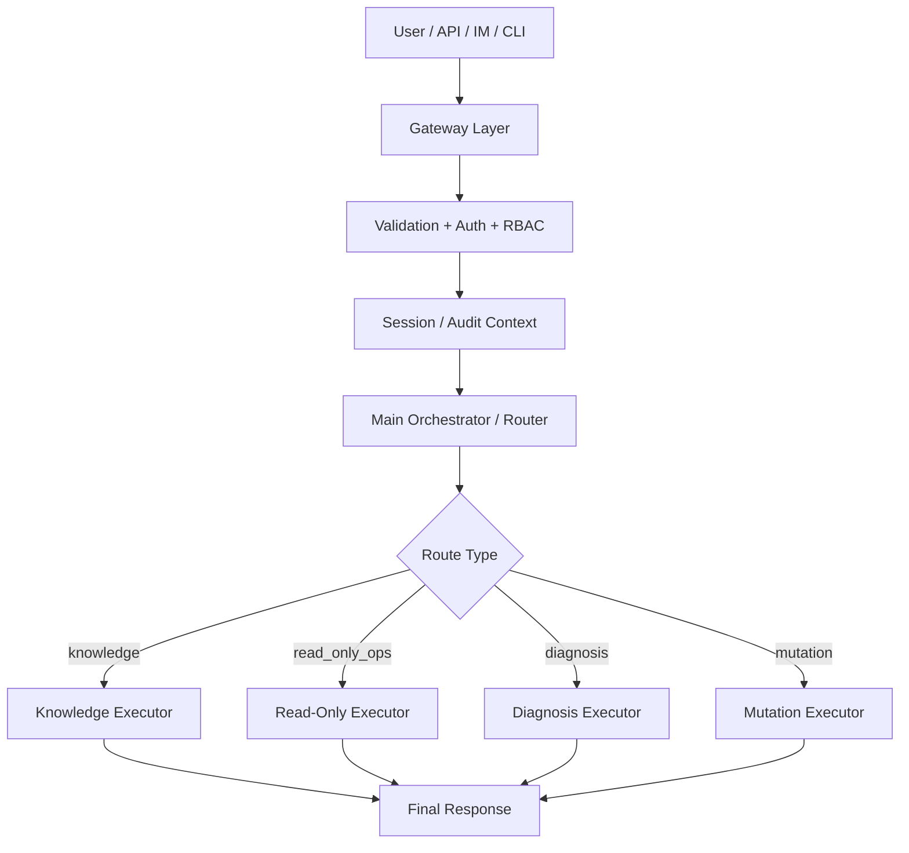

# OpsAgent - DevOps AI 智能运维助手

基于 LangChain + LangGraph 构建的企业级 DevOps AI Agent，通过自然语言交互完成 Jenkins Pipeline 管理、K8s 运维、日志分析和知识库问答。

## 核心能力

| 能力 | 描述 | 工具 |
|------|------|------|
| 🔧 Jenkins Pipeline | 自动生成 Jenkinsfile、查询构建状态、分析失败原因 | `jenkins_tool` |
| ☸️ K8s 运维 | Pod/Deployment/Service 状态查询、异常诊断 | `k8s_tool` |
| 📊 日志分析 | 日志搜索、错误聚合、LLM 根因分析 | `log_tool` |
| 📚 知识问答 | 环境信息、架构文档、SOP 流程的 RAG 问答 | `knowledge_tool` |

## 架构

当前推荐架构采用“路由优先 + 专用执行器”的模式，而不是所有请求都走统一 ReAct：

- `knowledge`：RAG-first，非 ReAct
- `read_only_ops`：确定性查询执行器
- `diagnosis`：受限 ReAct，限步取证
- `mutation`：计划 + 审批 + 执行 + 回读校验



详细设计见 [docs/architecture-deep-dive.md](./docs/architecture-deep-dive.md)。
Shared memory schema 和 agent 权限矩阵见 [docs/shared-memory-design.md](./docs/shared-memory-design.md)。

## 快速开始

### 1. 环境准备

```bash
# Python 3.11+
python -m venv venv
source venv/bin/activate  # Linux/Mac
# venv\Scripts\activate   # Windows

# 安装依赖
pip install -e ".[dev]"
```

### 2. 配置

```bash
cp .env.example .env
# 编辑 .env，至少填写 LLM API Key
```

**LLM 配置示例：**

```bash
# OpenAI
LLM_PROVIDER=openai
LLM_MODEL=gpt-4o
OPENAI_API_KEY=sk-xxx

# DeepSeek（便宜，中文好）
LLM_PROVIDER=deepseek
LLM_MODEL=deepseek-chat
OPENAI_API_KEY=sk-xxx
OPENAI_BASE_URL=https://api.deepseek.com/v1

# Claude
LLM_PROVIDER=anthropic
LLM_MODEL=claude-sonnet-4-20250514
ANTHROPIC_API_KEY=sk-ant-xxx

# 私有化部署 (vLLM)
LLM_PROVIDER=openai
LLM_MODEL=deepseek-v3
OPENAI_BASE_URL=http://your-server:8000/v1
```

### 3. 索引知识库（可选）

```bash
# 将项目文档索引到向量数据库
python main.py --index ./docs
```

### 4. 启动服务

```bash
# 启动 API 服务
python main.py

# 或用 Docker
docker-compose up -d
```

### 5. 交互式调试

```bash
python main.py --chat
```

## API 接口

### POST /api/chat — 对话（非流式）

```bash
curl -X POST http://localhost:8000/api/chat \
  -H "Content-Type: application/json" \
  -d '{
    "message": "帮我生成 user-service 的 Jenkins Pipeline，Java Maven 项目",
    "user_id": "dev@company.com"
  }'
```

### POST /api/chat/stream — 对话（SSE 流式）

```bash
curl -N http://localhost:8000/api/chat/stream \
  -H "Content-Type: application/json" \
  -d '{"message": "查一下 staging 环境 order-service 的 Pod 状态"}'
```

**SSE 事件格式：**

```
event: tool_call
data: {"tool": "get_pod_status", "input": {"namespace": "staging", "name_filter": "order"}}

event: tool_result
data: {"tool": "get_pod_status", "output": "..."}

event: message
data: {"content": "order-service 在 staging 环境有 3 个 Pod..."}

event: done
data: {"session_id": "xxx", "duration_ms": 2300}
```

### GET /api/tools — 查看已注册工具

### GET /api/audit — 查看审计日志

## 项目结构

```
ops-agent/
├── main.py                    # 启动入口
├── pyproject.toml             # 依赖管理
├── .env.example               # 配置模板
├── Dockerfile
├── docker-compose.yml
│
├── config/                    # 配置管理
│   └── settings.py            # Pydantic Settings
│
├── llm_gateway/               # LLM 多模型切换层
│   └── __init__.py            # LLMGateway (OpenAI/Anthropic/DeepSeek/Qwen)
│
├── agent_core/                # Agent 核心
│   ├── agent.py               # Route-first orchestrator + Streaming
│   ├── router.py              # Intent Router
│   ├── session.py             # Session abstraction
│   ├── schemas.py             # 公共类型定义
│   └── audit.py               # 审计日志
│
├── tools/                     # LangChain Tools
│   ├── jenkins_tool/          # Jenkins Pipeline 管理
│   ├── k8s_tool/              # K8s 集群运维
│   ├── log_tool/              # 日志搜索与分析
│   └── knowledge_tool/        # RAG 知识库
│
├── gateway/                   # API 网关
│   ├── app.py                 # FastAPI 应用
│   └── adapters/              # IM 适配器
│       └── im_adapter.py      # 企业微信/飞书/钉钉/Slack
│
├── docs/                      # 文档
├── tests/                     # 测试
└── jenkins_templates/         # Jenkinsfile 模板
```

## 扩展新工具

添加一个新的 Tool 只需三步：

```python
# 1. 创建 tools/my_tool/__init__.py
from langchain_core.tools import tool

@tool
async def my_custom_tool(param: str) -> str:
    """工具描述 - Agent 根据这个描述决定何时调用此工具。

    Args:
        param: 参数说明
    """
    # 实现逻辑
    return result

my_tools = [my_custom_tool]

# 2. 注册到 tools/__init__.py
from tools.my_tool import my_tools
ALL_TOOLS = jenkins_tools + k8s_tools + log_tools + knowledge_tools + my_tools

# 3. 完成！Agent 会自动识别新工具并在合适时调用
```

## 安全设计

- **RBAC 权限**：Viewer（只读）/ Operator（可操作）/ Admin（管理）
- **生产环境只读**：prod namespace 不允许任何写操作
- **操作确认**：危险操作（重启 Pod、触发构建）需用户确认
- **敏感信息脱敏**：密码/Token 在传入 LLM 和审计日志前自动脱敏
- **审计追踪**：所有操作记录完整日志

## 开发计划

- [x] Phase 1: Agent Core + Knowledge RAG + Web API
- [ ] Phase 2: Jenkins Tool + K8s Tool + IM 接入
- [ ] Phase 3: Log Analysis + 审计持久化 + 反馈优化
