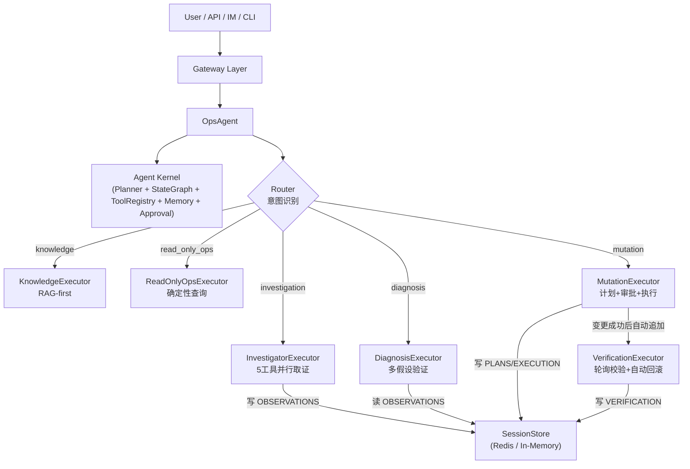

# OpsAgent

基于 LangChain + LangGraph 构建的 DevOps AI Agent。采用「Agent Kernel + Vertical Agent」分层架构：通用编排骨架在 `agent_kernel/`，Ops 垂直逻辑在 `agent_ops/`，覆盖知识问答、只读运维查询、Stage-0 事件聚合、故障诊断、受审批约束的变更执行和变更后自动校验。

## 当前状态

这是一个功能完整的 MVP，具备生产可用的核心骨架。已经实现：

- `knowledge`：RAG-first 知识问答
- `read_only_ops`：K8s / Jenkins / 日志的只读查询
- `investigation`：Stage-0 并行取证（5 工具同时采集，写入 OBSERVATIONS 层）
- `diagnosis`：多假设并行验证，5 层症状采集 + 拓扑驱动
- `mutation`：计划 + 审批门 + 执行，支持重启 / 扩缩容 / 回滚 / Jenkinsfile 生成 / 知识库索引
- `verification`：变更后自动轮询校验，失败自动回滚或升级告警
- `shared memory`：6 层分层共享记忆，带 RBAC 写入权限控制
- `session persistence`：Redis 持久化 session（`RedisSessionStore`），带 TTL 管理
- `approval state machine`：完整审批状态机，approval_receipt 绑定 step + 签发人 + 有效期
- `audit`：全链路工具调用审计，含参数脱敏
- `SSE`：流式输出 route、tool_call、tool_result、message、done 事件

## 架构

系统由六个 executor 组成闭环：



主架构文档见 [docs/architecture-v2.md](./docs/architecture-v2.md)。  
历史演进和 route-first 细节见 [docs/architecture-deep-dive.md](./docs/architecture-deep-dive.md)。  
Shared memory schema 和 agent 权限矩阵见 [docs/shared-memory-design.md](./docs/shared-memory-design.md)。

## 核心能力

| 路由 | 触发时机 | 典型工具 | 说明 |
|------|----------|----------|------|
| `investigation` | 上下文有活跃告警 + 短消息 / `force_investigate=True` | `get_pod_status`, `get_k8s_events`, `search_logs`, `query_jenkins_build` | 并行 5 工具，写 OBSERVATIONS，给诊断阶段提供上下文 |
| `knowledge` | 环境信息 / SOP / 文档问答 | `query_knowledge` | RAG-first，非 ReAct |
| `read_only_ops` | 查询 Pod / Deployment / Jenkins / 日志 | `get_pod_status`, `get_deployment_status`, `query_jenkins_build`, `search_logs`, `get_pod_logs` | 确定性查询，非 ReAct |
| `diagnosis` | 故障原因分析 / 排查 / 根因 | `diagnose_pod`, `get_pod_logs`, `get_k8s_events`, `query_jenkins_build`, `query_knowledge` | 多假设并行打分，5 层症状采集 |
| `mutation` | 重启 / 扩缩容 / 回滚 / 生成 / 索引 | `restart_deployment`, `scale_deployment`, `rollback_deployment`, `generate_jenkinsfile`, `index_documents` | 需审批，成功后自动追加 verification 步骤 |
| `verification` | Planner 自动追加（mutation 成功后） | `get_deployment_status`, `rollback_deployment` | 轮询校验，超时自动回滚 |

## Mutation 执行闭环

```
用户请求 → MutationExecutor
    │
    ├─ 提取目标、参数（正则 + 上下文）
    ├─ 构建 MutationPlan（action / target / VerificationCriteria / RollbackSpec）
    ├─ 检查审批（approval_receipt + step_id 绑定）
    ├─ 执行工具（restart_deployment / scale_deployment / rollback_deployment …）
    └─ 写 PLANS + EXECUTION 层
            │
            ▼
    OpsPlanner._maybe_replan()  ← mutation 成功后自动追加
            │
            ▼
    VerificationExecutor
    ├─ 读 PLANS 层的 MutationPlan
    ├─ 轮询 get_deployment_status（默认 10s × 6 次）
    ├─ 成功 → 写 VERIFICATION 层，返回确认消息
    └─ 失败 → 调用 rollback_deployment（预授权，无需再次审批）
              └─ 若回滚也失败 → 返回升级告警消息
```

## 两阶段告警调查（有限多 Agent）

```
模糊问题 / 活跃告警
        │
        ▼
InvestigatorExecutor  ← Stage-0
  asyncio.gather:
    ┌─ get_pod_status        ─┐
    ├─ get_deployment_status  │  并行执行
    ├─ get_k8s_events         │
    ├─ search_logs (ERROR)   ─┘
    └─ query_jenkins_build
  写 OBSERVATIONS 层
  返回结构化告警摘要
        │
        ▼
DiagnosisExecutor  ← 读 OBSERVATIONS，跳过重复采集
  多假设生成 + 并行取证 + 打分输出根因
```

## Shared Memory

系统在 session 内维护 6 层共享记忆，带 RBAC 写入权限：

| 层 | 写入者 | 内容 |
|----|--------|------|
| `facts` | `knowledge_agent` | 环境事实（namespace / service / env） |
| `observations` | `read_ops_agent`, `diagnosis_agent` | 工具观察结果（pod_status / error_summary） |
| `hypotheses` | `diagnosis_agent` | 根因假设和置信分 |
| `plans` | `change_planner` | MutationPlan（action / verification / rollback） |
| `execution` | `change_executor` | 工具执行结果 |
| `verification` | `verification_agent` | 校验结论和回滚状态 |

## 测试

当前 84 个测试全部通过，分两层：

- `tests/test_agent.py`：Ops vertical 功能回归（路由、工具、诊断、mutation、记忆）
- `tests/kernel_contract/`：Kernel 框架契约（自定义 route / memory layer / 审批门 / 实例隔离 / 动态 executor wiring）
- `tests/test_patterns_approval_gate.py`：审批门模式测试
- `tests/test_patterns_multi_hypothesis.py`：多假设模式测试

```bash
python3 -m pytest -q
```

## 快速开始

### 1. 环境准备

```bash
python -m venv venv
source venv/bin/activate
pip install -e ".[dev]"
```

要求：Python `>= 3.11`

### 2. 配置

```bash
cp .env.example .env
```

默认本地 Docker 端口：

- PostgreSQL: `localhost:5433`
- Redis: `localhost:6380`

至少配置一组可用的 LLM 凭据：

```bash
# OpenAI
LLM_PROVIDER=openai
LLM_MODEL=gpt-4o
OPENAI_API_KEY=sk-xxx

# Router 使用轻量模型
ROUTER_LLM_PROVIDER=openai
ROUTER_LLM_MODEL=gpt-4o-mini

# DeepSeek
LLM_PROVIDER=deepseek
LLM_MODEL=deepseek-chat
OPENAI_API_KEY=sk-xxx
OPENAI_BASE_URL=https://api.deepseek.com/v1

# Anthropic
LLM_PROVIDER=anthropic
LLM_MODEL=claude-sonnet-4-20250514
ANTHROPIC_API_KEY=sk-ant-xxx
```

常用配置项：

- `K8S_ALLOWED_NAMESPACES`：允许操作的 K8s namespace（逗号分隔）
- `K8S_READONLY_NAMESPACES`：只读 namespace（逗号分隔）
- `KNOWLEDGE_PG_DSN`：PostgreSQL 连接串（知识库向量存储）
- `EMBEDDING_PROVIDER` / `EMBEDDING_MODEL`：Embedding 模型
- `REDIS_URL`：Redis 连接串（session 持久化），不配置则使用内存实现
- `SERVER_HOST` / `SERVER_PORT`：API 服务监听地址

### 3. 索引知识库

```bash
python main.py --index ./docs
```

### 4. 启动服务

```bash
python main.py
# 或
docker compose up -d
```

### 5. 交互式调试

```bash
python main.py --chat
```

## API

### `POST /api/chat`

非流式对话接口。

```bash
curl -X POST http://localhost:8000/api/chat \
  -H "Content-Type: application/json" \
  -d '{
    "message": "查一下 staging 的 order-service pod 状态",
    "user_id": "dev@company.com",
    "user_role": "viewer",
    "context": {}
  }'
```

触发告警调查：

```bash
curl -X POST http://localhost:8000/api/chat \
  -H "Content-Type: application/json" \
  -d '{
    "message": "看看 payment-service 的情况",
    "user_id": "oncall@company.com",
    "user_role": "operator",
    "context": {"force_investigate": true}
  }'
```

### `POST /api/chat/stream`

SSE 流式接口。

```bash
curl -N http://localhost:8000/api/chat/stream \
  -H "Content-Type: application/json" \
  -d '{
    "message": "帮我分析 staging 的 order-service 为什么一直报错",
    "user_id": "dev@company.com",
    "user_role": "operator"
  }'
```

输出事件：`route` / `tool_call` / `tool_result` / `message` / `sources` / `done`

### 其他接口

- `GET /health`
- `GET /api/tools`
- `GET /api/audit`

## 多轮示例

跨路由上下文继承：

1. `order-service 在哪个环境？` → `knowledge` 把 `service / env / namespace` 写入 shared memory
2. `帮我看看它的 pod 有没有报错` → `read_only_ops` 从 shared memory 补齐参数
3. `分析一下怎么处理` → `diagnosis` 读 `facts + observations + artifacts` 做多假设诊断
4. `帮我重启一下` → `mutation` 提取服务名，构建 MutationPlan，等待审批
5. `[用户确认审批]` → 执行 `restart_deployment`，Planner 自动追加 verification 步骤
6. `[VerificationExecutor 自动]` → 轮询 `get_deployment_status`，确认副本全部 Running

## 安全边界

- `Viewer` 不能走 mutation 路由
- 所有 mutation 工具默认 `requires_approval=True`，需携带与 step 绑定的 `approval_receipt`
- `approval_receipt` 包含签发人、step_id、有效期，Kernel 强制校验，不能复用到其他 step
- VerificationExecutor 调用 `rollback_deployment` 时预授权（`OpsApprovalPolicy` 特殊处理），原 mutation 审批覆盖补偿动作
- 所有工具调用经 `_invoke_tool` 统一审计，敏感参数进入脱敏流程
- K8s 写操作通过 `K8S_ALLOWED_NAMESPACES` 约束可操作范围

## 项目结构

```text
ops-agent/
├── main.py
├── pyproject.toml
├── .env.example
├── Dockerfile
├── docker-compose.yml
├── config/
│   └── settings.py
├── agent_kernel/                    ← 通用编排骨架（零 Ops 知识）
│   ├── base_agent.py                ← BaseAgent：图编排 + chat / chat_stream
│   ├── approval.py                  ← ApprovalPolicy 抽象 + approval_receipt 校验
│   ├── audit.py                     ← AuditLogger + 参数脱敏
│   ├── executor.py                  ← ExecutorBase 抽象
│   ├── planner.py                   ← Planner：生成 Plan，advance / replan
│   ├── router.py                    ← RouterBase 抽象
│   ├── schemas.py                   ← Plan / PlanStep / ChatRequest / ToolCallEvent …
│   ├── session.py                   ← SessionStore（内存实现）
│   ├── session_redis.py             ← RedisSessionStore（Redis 持久化）
│   ├── memory/
│   │   ├── backend.py               ← MemoryBackend 接口
│   │   └── schema.py                ← MemorySchema + RBAC 校验
│   ├── patterns/
│   │   ├── approval_gate.py         ← 审批门模式（可复用）
│   │   └── multi_hypothesis.py      ← 多假设并行模式（可复用）
│   └── tools/
│       ├── mcp_gateway.py           ← MCPClient：MCP 服务器注册 + 工具加载
│       └── registry.py              ← ToolRegistry：本地 + MCP 工具统一注册
├── agent_ops/                       ← Ops 垂直（继承 Kernel 基类）
│   ├── agent.py                     ← OpsAgent 装配入口
│   ├── planner.py                   ← OpsPlanner：_maybe_replan（mutation 后追加 verification）
│   ├── router.py                    ← IntentRouter：关键词 + 上下文信号 + LLM fallback
│   ├── schemas.py                   ← AgentRoute / IntentType / Hypothesis / ServiceNode …
│   ├── memory_schema.py             ← OPS_MEMORY_SCHEMA（6 层 + RBAC）
│   ├── memory_hooks.py              ← store_mutation_plan / load_mutation_plan / write_verification_memory
│   ├── mutation_plan.py             ← MutationPlan / VerificationCriteria / RollbackSpec + 工厂函数
│   ├── risk_policy.py               ← OpsApprovalPolicy（namespace 约束 + 回滚预授权）
│   ├── extractors.py                ← extract_namespace / extract_service_name / extract_pod_name
│   ├── formatters.py                ← 各路由的响应格式化函数
│   ├── tool_setup.py                ← register_ops_tools（16 个工具注册）
│   ├── topology.py                  ← ServiceTopology（服务依赖图）
│   └── executors/
│       ├── knowledge.py             ← KnowledgeExecutor（RAG-first）
│       ├── read_only.py             ← ReadOnlyOpsExecutor（确定性查询）
│       ├── investigator.py          ← InvestigatorExecutor（Stage-0 并行取证）
│       ├── diagnosis.py             ← DiagnosisExecutor（多假设 + 5 层症状采集）
│       ├── mutation.py              ← MutationExecutor（计划 + 审批 + 执行）
│       └── verification.py         ← VerificationExecutor（轮询校验 + 自动回滚）
├── gateway/
│   ├── app.py                       ← FastAPI 应用（/api/chat, /api/chat/stream）
│   └── adapters/
│       └── im_adapter.py            ← IM 适配骨架
├── llm_gateway/
│   └── __init__.py                  ← LLM 提供商抽象（OpenAI / DeepSeek / Anthropic）
├── tools/
│   ├── k8s_tool/                    ← K8s 工具（含 restart / scale / rollback / events 写操作）
│   ├── jenkins_tool/                ← Jenkins 工具（查询构建、触发流水线）
│   ├── knowledge_tool/              ← 知识库工具（查询 / 索引）
│   └── log_tool/                    ← 日志工具（关键词搜索）
├── docs/
│   ├── architecture-v2.md           ← 主架构文档（Kernel + Vertical + Supervisor）
│   ├── architecture-deep-dive.md    ← Route-first 演进历史
│   └── shared-memory-design.md      ← 6 层记忆 schema 和权限矩阵
└── tests/
    ├── test_agent.py                ← Ops vertical 功能回归（84 个用例）
    ├── test_patterns_approval_gate.py
    ├── test_patterns_multi_hypothesis.py
    └── kernel_contract/
        └── test_kernel_contract.py  ← Kernel 框架契约测试
```

## 静态检查

```bash
# 运行测试
python3 -m pytest -q

# 语法检查
python3 -m py_compile $(rg --files -g '*.py')

# Lint
ruff check agent_ops/ agent_kernel/
```

## 已知限制

- `main.py` 和 `gateway/app.py` 仍使用 `reload=True`
- `RedisSessionStore` 使用同步 redis 客户端，生产环境建议换 `redis.asyncio`
- IM adapter 目前是骨架，未对接真实 IM 平台
- 工具层依赖真实 K8s / Jenkins 环境，本地无环境时工具调用会返回模拟/错误结果
- `agent_core/` 目录仍保留（历史残余），不再使用

## 演进方向

- Supervisor 多 Agent 模式（≥ 2 个垂直稳定运行后启动）
- 接入 MCP + tool retrieval，替换静态 16 工具列表
- Router 升级为支持图内回跳的 meta-planner
- 建立 eval harness + incident case 反向沉淀
- 对接真实 IM 平台（钉钉 / 飞书 / Slack）

完整差距分析见 [docs/architecture-deep-dive.md §8](./docs/architecture-deep-dive.md)。
