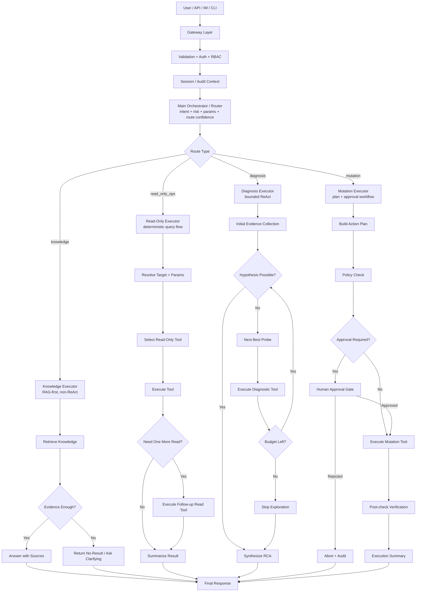
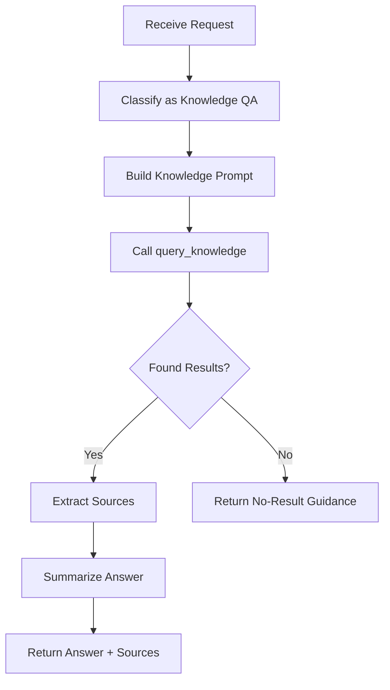
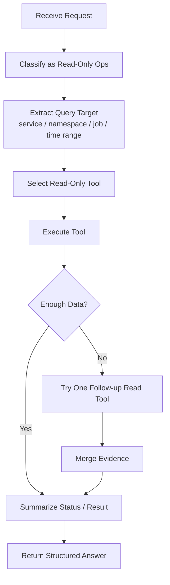
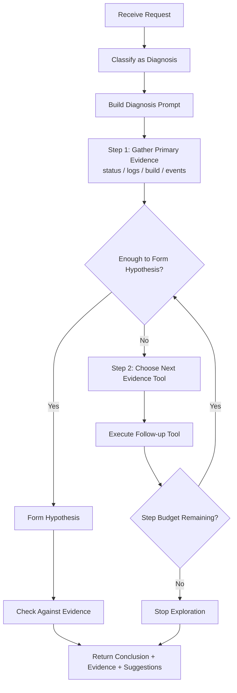
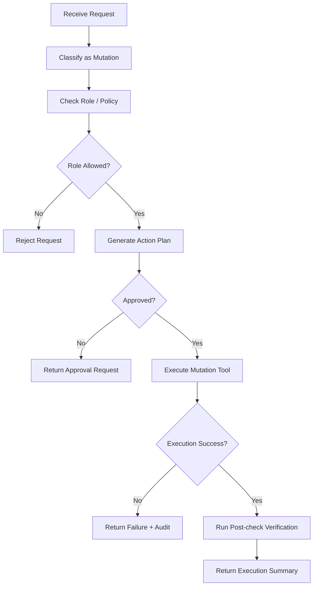
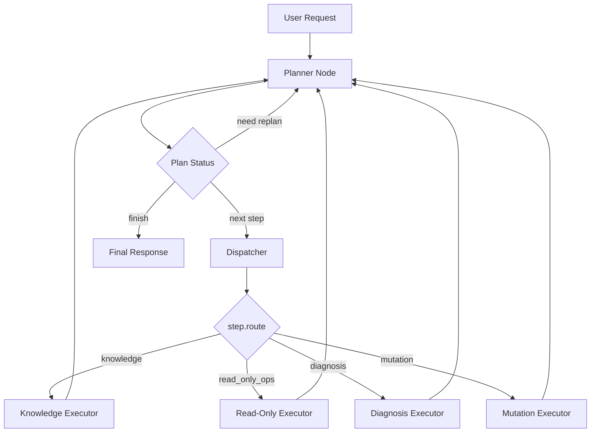
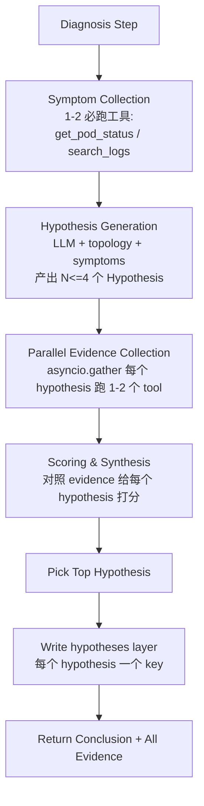

# OpsAgent 推荐架构深度解析

> **定位说明**
>
> 本文档主要解释 OpsAgent 在 route-first 阶段的设计思路、控制流和演进背景。
> 当前推荐目标架构请以 [`architecture-v2.md`](./architecture-v2.md) 为准。
>
> 可以把两份文档理解成：
>
> - 本文回答“旧实现怎么工作、为什么继续演进”
> - `architecture-v2.md` 回答“现在应该如何分层、契约如何落地”

本文档描述 OpsAgent 的推荐版 Agent 架构。目标不是”让所有请求都走 ReAct”，而是把不同任务映射到不同的执行范式：

- `knowledge`：RAG-first，非 ReAct
- `read_only_ops`：确定性查询执行器，非 ReAct
- `diagnosis`：拓扑驱动的多假设并行验证，bounded ReAct 兜底
- `mutation`：计划 + 审批 + 执行 + 回读校验

并由 **Planner** 串联多个 executor，**Tool Registry** 统一所有本地与远端 MCP 工具。

Shared memory 的结构和权限矩阵见 [shared-memory-design.md](./shared-memory-design.md)。

## 一、推荐版总体控制流



## 二、为什么不是“主 Agent + 所有子路由都 ReAct”

这种系统最容易犯的错，是把所有问题都 agent 化。这样会带来三个问题：

1. 简单查询被复杂化。查 Pod 状态、查构建结果，本来只需要一次工具调用，却被放进多轮推理。
2. 高风险变更失控。变更类任务如果也走自由 ReAct，会把权限、审批和幂等控制交给 prompt。
3. 审计难以闭环。没有明确的路由执行契约时，很难解释“为什么走这条路、为什么用了这个工具、为什么停在这里”。

因此推荐版的关键不是“多 Agent”，而是“路由后使用专用执行器”。

## 三、四条路由的职责和范式

### 3.1 `knowledge`

范式：`RAG-first + constrained synthesis`

目标：
- 从知识库中检索事实
- 输出带来源的回答
- 不调用运维实时查询工具

执行契约：
- 优先调用 `query_knowledge`
- 检索不到就明确说未命中
- 成功标准是“回答有来源”，不是“回答得像”

### 3.2 `read_only_ops`

范式：`deterministic query executor`

目标：
- 对 Jenkins / K8s / 日志系统做只读查询
- 尽量一次命中合适的工具
- 最多做一次补充查询

执行契约：
- 先解析目标实体和参数
- 再选择只读工具
- 最终输出状态摘要

### 3.3 `diagnosis`

范式：`bounded ReAct`

目标：
- 收集证据
- 做有限步的多源排障
- 输出结论、证据、建议动作

执行契约：
- 允许多步工具探索
- 必须设置步数预算
- 必须先证据后结论

### 3.4 `mutation`

范式：`plan -> approval -> execute -> verify`

目标：
- 承载所有有副作用的动作
- 在审批门后执行
- 输出可审计的执行摘要

执行契约：
- 先生成计划
- 做 RBAC 和策略校验
- 未审批时只返回计划，不执行工具
- 执行后必须做回读验证

当前已接入的 mutation 示例：
- Jenkinsfile 生成
- 知识库文档索引

## 四、代码分层

这里分两层理解：

- **旧实现视角**：下面这张图说明 route-first 阶段代码怎么组织
- **当前目标视角**：请以 `architecture-v2.md` 中的 `agent_kernel/ + agent_ops/` 分层为准

```
gateway/
  app.py                      # API / SSE / request parsing

agent_core/                   # 旧兼容入口 / 过渡层

agent_kernel/
  base_agent.py               # 主 orchestrator + graph wiring
  planner.py                  # planner / advance / replan
  router.py                   # RouterBase / RouteDecision 契约
  session.py                  # session / memory store 接口与默认实现
  audit.py                    # 审计与工具轨迹
  schemas.py                  # plan / tool / response 契约

agent_ops/
  ops_agent.py                # Ops 装配入口
  router.py                   # OpsKeywordRouter
  executors/
    knowledge.py              # RAG executor
    read_only_ops.py          # deterministic query executor
    diagnosis.py              # multi-hypothesis diagnosis executor
    mutation.py               # approval workflow executor
  topology.py                 # Ops 专属服务拓扑
  extractors.py               # namespace / service / pod / build 等提取逻辑
  formatters.py               # 结果格式化
  memory_hooks.py             # Ops memory 写入规则
```

如果本文后面提到 `agent_core/agent.py` / `agent_core/router.py` 等路径，请理解为“旧实现里的实际文件位置”。
在新的分层设计里，这些职责已经分别迁往 `agent_kernel/` 与 `agent_ops/`。

## 五、函数级控制流图

下面这张图对应当前实际代码，而不是理想化概念图。每个节点都落到具体函数。

```mermaid
flowchart TD
    A["gateway.app.chat() / chat_stream()"] --> B["OpsAgent.chat()<br/>OpsAgentStreaming.chat_stream()"]
    B --> C["_build_initial_state()"]
    C --> D["graph.ainvoke() / manual streaming dispatch"]

    D --> E["_route_node()"]
    E --> F["IntentRouter.route()"]
    F --> F1["_contains_any() keyword routing"]
    F --> F2["_route_with_llm() fallback"]
    F1 --> G["_select_route_node()"]
    F2 --> G

    G --> H{"route"}
    H -->|knowledge| I["_knowledge_node()"]
    H -->|read_only_ops| J["_read_only_node()"]
    H -->|diagnosis| K["_diagnosis_node()"]
    H -->|mutation| L["_mutation_node()"]

    I --> I1["_execute_knowledge()"]
    I1 --> I2{"_is_index_request()?"}
    I2 -->|No| I3["_extract_top_k()"]
    I3 --> I4["_invoke_tool('query_knowledge')"]
    I4 --> I5["_extract_sources()"]
    I5 --> I6["_format_knowledge_result()"]

    I2 -->|Yes| I7["_extract_docs_directory()"]
    I7 --> I8["_invoke_tool('index_documents')"]
    I8 --> I9["_format_index_result()"]

    J --> J1["_execute_read_only_ops()"]
    J1 --> J2["_plan_read_only_tool()"]
    J2 --> J3["_extract_namespace() / _extract_service_name() / _extract_job_name()"]
    J2 --> J4["_extract_build_number() / _extract_time_range() / _extract_pod_name()"]
    J2 --> J5["_extract_log_level() / _extract_keyword()"]
    J3 --> J6["_invoke_tool(...)"]
    J4 --> J6
    J5 --> J6
    J6 --> J7["_format_read_only_summary()"]
    J7 --> J8["_format_single_read_only_result()"]

    K --> K1["_run_route_subgraph(route=DIAGNOSIS)"]
    K1 --> K2["_build_route_prompt()"]
    K2 --> K3["_execute_bounded_tool_loop()"]
    K3 --> K4["llm_gateway.get_main_model().bind_tools()"]
    K4 --> K5["response.tool_calls?"]
    K5 -->|Yes| K6["tool loop + ToolMessage append"]
    K6 --> K7["_extract_sources()"]
    K7 --> K3
    K5 -->|No| K8["_normalize_message_content()"]

    L --> L1["_execute_mutation()"]
    L1 --> L2{"Viewer?"}
    L2 -->|Yes| L9["return permission denial"]
    L2 -->|No| L3{"_is_index_request()?"}
    L3 -->|Yes| L4["_extract_docs_directory()"]
    L4 --> L5{"_approval_granted()?"}
    L5 -->|No| L10["return approval message"]
    L5 -->|Yes| L11["_invoke_tool('index_documents')"]
    L11 --> L12["_format_index_result()"]

    L3 -->|No| L6["_build_pipeline_plan()"]
    L6 --> L7["_extract_language() + helper extractors"]
    L7 --> L8{"_approval_granted()?"}
    L8 -->|No| L13["_format_mutation_plan()"]
    L8 -->|Yes| L14["_invoke_tool('generate_jenkinsfile')"]
    L14 --> L15["_format_mutation_execution()"]

    I6 --> Z["_persist_session_turn()"]
    I9 --> Z
    J8 --> Z
    K8 --> Z
    L9 --> Z
    L10 --> Z
    L12 --> Z
    L13 --> Z
    L15 --> Z

    Z --> AA["_audit_request()"]
    AA --> AB["audit_logger.log()"]
    AB --> AC["ChatResponse / SSE events"]
```



函数和文件对应关系：

- 主入口与图编排：`agent_core/agent.py`
- 路由策略：`agent_core/router.py`
- 会话：`agent_core/session.py`
- 审计：`agent_core/audit.py`

如果后续把执行器拆文件，推荐映射如下：

- `_execute_knowledge()` -> `agent_core/executors/knowledge.py`
- `_execute_read_only_ops()` -> `agent_core/executors/read_only_ops.py`
- `_run_route_subgraph()` 与 `_execute_bounded_tool_loop()` -> `agent_core/executors/diagnosis.py`
- `_execute_mutation()` -> `agent_core/executors/mutation.py`

## 六、每条路由的推荐状态机

### `knowledge`



### `read_only_ops`



### `diagnosis`



### `mutation`



## 七、实现优先级

建议按以下顺序落地：

1. 先把 `router` 固化成 orchestrator，而不是大一统 ReAct。
2. 把 `knowledge` 和 `read_only_ops` 收紧成确定性执行器。
3. 把 `diagnosis` 作为唯一保留明显 ReAct 味道的路由。
4. 把 `mutation` 做成显式审批工作流。
5. 最后再把 session / audit 持久化到 Redis / DB。

## 八、当前架构的已知弱点和演进方向

这一节记录当前架构相对于 2025 年头部 vertical ops agent（Cleric、Parity、HolmesGPT 等）的差距。目的不是全面追赶，而是把"设计层面的妥协"显式化，避免在后续迭代中被误当成优点延续。

### 8.1 路由一次定终身

- 问题：`IntentRouter.route()` 是一次性分类，路由错了会走错路径到底；混合意图（如"为什么挂了，顺便帮我重启"）被迫拆成多轮。
- 演进方向：把 router 升级为 **planner-style orchestrator**，允许 graph 内回跳、多 executor 串联，由一个 plan 节点动态决定下一步走哪个 executor。
- 影响面：`agent_core/router.py` 与 `agent_core/agent.py` 的 graph wiring。

### 8.2 缺少并行假设验证

- 问题：`diagnosis` 是 bounded ReAct 串行探查，一次只验证一个假设。
- 演进方向：引入 **multi-hypothesis parallel verification**，并行发起 N 个假设、各自取证、汇总打分。这是头部 vertical ops agent 拉开 MTTR 差距的核心能力。
- 前置条件：executor 内部需要 fan-out / fan-in 能力，`SharedMemory.hypotheses` 需要支持多条并存而非单一 `likely_root_cause`。

### 8.3 工具选择是硬编码 extractor

- 问题：`_extract_namespace / _extract_service_name / _extract_job_name` 这类正则式抽取，维护成本随工具数量线性增长；接入新系统必须改代码。
- 演进方向：
  1. 接入 **MCP** 作为工具总线，把工具层从进程内硬编码解耦。
  2. 引入 **tool retrieval**，按语义召回 top-k 工具再交给 LLM 选择。
- 这是与"先进" vertical agent 差距最大的单点。

### 8.4 Shared memory 是 flat key-value，缺实体和因果模型

- 问题：`observations` 当前是 `last_pod_status` 这类字符串字段，无法表达"service A 依赖 service B，B 出错影响 A"这类拓扑/因果关系。
- 演进方向：在 `facts` 之上叠加 **服务拓扑图 + 依赖/因果图**，作为 diagnosis 的结构化先验，而不是每次都从零推断。
- 取舍：这一项投入大，建议在 8.1 / 8.3 落地后再做。

### 8.5 没有反馈 / 学习闭环

- 问题：mutation 执行完 + verification 通过 / 失败之后，结果没有回写到知识库或 case base；knowledge 只能靠 `index_documents` 单向灌入。
- 演进方向：建立 **incident → runbook / case 反向沉淀**，把解决过的事故结构化沉淀，使下次类似事故能命中。
- 数据模型：可复用 `ExecutionArtifact` 作为原料，叠加一层 `IncidentCase`。

### 8.6 审批是二值，不是风险分级

- 问题：`_approval_granted()` 是布尔判断；`schemas.py` 里已有 risk 字段但未和审批策略联动。
- 演进方向：做成 **risk-tiered approval**，低风险自动通过、中风险单人审批、高风险双人 + 时间窗。参考 Spinnaker / Argo Rollouts 的 manual judgement 模型。

### 8.7 没有 dry-run / simulation

- 问题：mutation 路径是"审批 → 直接执行 → 回读"，审批人在看不见后果的前提下点同意。
- 演进方向：在审批前插入 **dry-run / diff preview** 节点（对标 `kubectl diff`、`terraform plan`），把预期变化作为审批材料的一部分。
- 插入位置：`mutation` 状态机 `Generate Action Plan` 之后、`Human Approval Gate` 之前。

### 8.8 没有 prompt / agent 评测体系

- 问题：仓库只有一个 `test_agent.py`，prompt 一动就是黑盒回归。
- 演进方向：建立 **eval harness**，固定 case set + 自动化打分；至少覆盖四条路由各自的代表性 case。
- 这一项不影响运行时架构，但会决定后续迭代速度。

### 8.9 单租户 / 单 session memory

- 问题：shared memory 绑死在单个 session 上，团队 / 组织级上下文（"昨天值班同事查过这个 pod"）无法复用。
- 演进方向：引入 **组织级 memory 层**，位于 session memory 之上，作为跨 session / 跨用户的共享知识。
- 需要同时解决：权限隔离、写入仲裁、TTL 策略。

### 8.10 没有 replay / time-travel

- 问题：只有 audit log，调 prompt / 调 graph 时无法"从某一步回放或分叉重跑"。
- 演进方向：把每个节点的输入 / 输出结构化持久化，支持从任意节点 replay。可以直接接 LangSmith / Langfuse，不一定自研。

### 8.11 演进优先级

按"收益 / 投入"排序，建议：

1. **MCP + tool retrieval**（8.3）—— 投入小，解耦彻底，外部集成能力指数级扩展。
2. **Router → Planner**（8.1）—— 解决混合意图，是后续 8.2 / 8.7 的前置。
3. **Multi-hypothesis diagnosis**（8.2）—— 真正拉开 ops 场景 MTTR 的关键。
4. **Eval harness**（8.8）—— 在上述三项动工前先铺好，否则无法衡量效果。
5. **Risk-tiered approval + dry-run**（8.6 / 8.7）—— 把 mutation 从"能跑"推到"敢放开给生产"。
6. **拓扑 / 因果模型 + 学习闭环**（8.4 / 8.5）—— 长期竞争力，但依赖前几项先就位。
7. **组织级 memory + replay**（8.9 / 8.10）—— 体验层改进，可以晚做。

这一优先级与第七节的"当前实现优先级"是两条平行的 roadmap：第七节对应"把现有骨架做实"，第八节对应"跨代追赶"。

## 九、第二代架构：Planner + Tool Registry + 拓扑驱动诊断

第八节列出了演进方向，本节给出其中三项的**目标架构**（已落地为代码）：

- **Planner**（取代静态 Router）：把入口分流升级为可循环、可串联的规划节点
- **Tool Registry + MCP Gateway**：把工具层从硬编码 `route → tool` 映射，升级为按需检索 + 统一规范
- **Topology-aware Multi-hypothesis Diagnosis**：用服务拓扑作为先验，并行验证多个假设

### 9.1 Planner-driven 控制流



#### Plan / PlanStep schema

下面这份 schema 适合表达 route-first 阶段的核心控制流。
如果按 `architecture-v2.md` 落地，建议做两处修正：

- `route` 继续表示“Vertical 内部 executor 类别”
- 新增 `execution_target` 表示“这一步实际派发给谁”，尤其是 Supervisor 场景

```python
class PlanStepStatus(str, Enum):
    PENDING = "pending"
    RUNNING = "running"
    SUCCEEDED = "succeeded"
    FAILED = "failed"
    SKIPPED = "skipped"

class PlanStep(BaseModel):
    step_id: str
    route: str
    execution_target: str = ""      # e.g. "executor:diagnosis" / "agent:ops"
    intent: IntentType
    goal: str                       # 自然语言描述本步要达成的目标
    inputs: dict[str, Any]          # 已抽取的参数
    risk_level: RiskLevel
    requires_approval: bool = False
    depends_on: list[str] = []      # 其他 step_id
    status: PlanStepStatus = PlanStepStatus.PENDING
    result_summary: str = ""

class Plan(BaseModel):
    plan_id: str
    steps: list[PlanStep]
    cursor: int = 0                 # 下一个要执行的 step index
    iterations: int = 0
    max_iterations: int = 6
    done: bool = False
    final_message: str = ""
```

#### Planner 决策契约

Planner 节点每次被调用时：

1. 读取 `state.plan`（首次为空）+ shared memory + 上一步的 `result_summary`。
2. 如果 `plan` 为空：基于用户消息和 memory 生成初始 Plan（可能 1 步，也可能多步）。
3. 如果 `plan` 已存在但当前 step 已完成：
   - 检查是否还有未完成 step → `continue`
   - 上一步结果暗示需要新 step（如 diagnosis 给出 RCA、用户隐含希望执行修复）→ `replan`，追加新 step
   - 全部完成 → `finish`，写 `final_message`
4. 输出 `{plan, decision: continue/replan/finish}`。

Planner 内部分两段实现，性能与可解释性兼顾：

- **Fast path**：复用现有 `IntentRouter` 的关键词分类，命中即生成单步 Plan（保持旧行为，避免对简单查询多花一次 LLM）。
- **Slow path**：fast path 没命中或 replan 时，调用 router LLM 生成结构化 Plan（pydantic schema 强约束）。

#### 终止条件

- `plan.done == True`
- `plan.iterations >= plan.max_iterations`
- 任意 step 状态为 `FAILED` 且 planner 判定不可恢复
- mutation step 缺少与该 step 绑定、可校验、未过期的 `approval_receipt` → 写 final_message 并 `finish`

### 9.2 Tool Registry + MCP Gateway

#### 目标

- 把工具描述（name / desc / tags / params）从代码硬编码集中到一个 `ToolRegistry`。
- Executor 不再绑定固定 tool 列表，而是用 `goal + route + memory hint` 检索 top-k 工具。
- 远端 MCP server 注册的工具通过同一 `ToolSpec` 进入 registry，对 executor 不可见差异。

#### ToolSpec schema

按新版 v2 的契约，`route_affinity` 更适合是 `RouteKey` / `str`，
不要依赖“运行时可扩展 Python Enum”。

```python
class ToolSource(str, Enum):
    LOCAL = "local"
    MCP = "mcp"

class ToolSpec(BaseModel):
    name: str
    description: str
    tags: list[str] = []                # ["k8s", "pod", "status"]
    route_affinity: list[str]           # 哪些 route 可以用
    side_effect: bool = False           # True 表示有写副作用
    source: ToolSource = ToolSource.LOCAL
    handler: Any = None                 # callable 或 MCP proxy
    parameters_schema: dict[str, Any] = {}
```

#### 检索策略（v1）

```
score(spec, query, route) =
    1.5 * tag_match(spec.tags, keywords(query))
  + 1.0 * route_match(spec.route_affinity, route)
  + 0.5 * description_keyword_overlap(spec.description, query)
```

- v1 不强求 embedding 检索，先用关键词 + 标签 + route affinity 做加权打分。
- 留 `EmbeddingRetriever` 接口，后续可接入向量库做语义召回。

#### MCP Gateway

- `tools/mcp_gateway.py` 提供 `MCPClient`：`register_remote_server(url, auth)` + `list_tools()` + `call_tool(name, args)`。
- v1 提供本地 stub 实现：`MCPClient.load_tools()` 在没有远端 server 时返回空列表，但 ToolSpec 抽象保证未来真实接入时不需要改 executor。
- 远端工具进入 registry 时 `source=MCP`，`handler` 为 async proxy。

#### Executor 适配

- `_run_route_subgraph`（diagnosis / mutation 的 LLM 调用段）改为：
  1. 从 `tool_registry.retrieve(goal=step.goal, route=step.route, top_k=6)` 拿候选 ToolSpec
  2. 把候选 ToolSpec 的 LangChain Tool handler 喂给 `llm.bind_tools(...)`
  3. 其余流程不变
- `read_only_ops` 保留现有的 hand-crafted extractor 作为 fast path，但当 fast path 返回空时 fallback 到 registry retrieve + LLM 工具选择。

### 9.3 Topology-aware Multi-hypothesis Diagnosis

#### 服务拓扑模型

```python
class ServiceNode(BaseModel):
    name: str
    namespace: str
    env: str = "default"
    owner: str = ""
    runtime: str = ""                # "java" / "node" / ...
    dependencies: list[str] = []     # downstream service names
    tags: list[str] = []

class ServiceTopology:
    def get(self, name: str) -> ServiceNode | None: ...
    def dependents(self, name: str) -> list[ServiceNode]: ...     # 反向依赖
    def neighbors(self, name: str, depth: int = 1) -> list[ServiceNode]: ...
```

- 数据源：`config/topology.yaml`（缺省为空文件，不强制）
- 后续可加 K8s service graph 自动推断、Istio mesh 元数据等数据源
- 拓扑作为只读先验注入 diagnosis prompt + 假设生成

#### Hypothesis schema

```python
class HypothesisVerdict(str, Enum):
    UNVERIFIED = "unverified"
    SUPPORTED = "supported"
    REJECTED = "rejected"
    INCONCLUSIVE = "inconclusive"

class Hypothesis(BaseModel):
    hypothesis_id: str
    statement: str                 # "order-service OOM 触发了 frontend 502"
    suspected_target: str          # 服务名 / pod 名
    evidence_tools: list[str]      # 计划用哪些 tool 取证
    score: float = 0.0
    verdict: HypothesisVerdict = HypothesisVerdict.UNVERIFIED
    evidence_summary: str = ""
```

#### Diagnosis 流程



关键点：

- **N 上界**为 4，避免 LLM 失控生成无意义假设。
- **取证并行**用 `asyncio.gather`，整体延迟接近单条诊断链。
- **打分函数**v1 简单：每条 evidence 按 `error_signal_match * tool_success * recency_decay` 累加。
- **拓扑用法**：生成假设时把 `suspected_target` 的 dependencies 和 dependents 注入 prompt，让 LLM 优先考虑跨服务影响。

#### 与 Planner 的协作

- Planner 把 diagnosis 拆为单个 PlanStep（如 `route="diagnosis"` / `execution_target="executor:diagnosis"`），但 diagnosis executor 内部就是上面这套多假设流程。
- 如果 diagnosis 输出的 top hypothesis 暗示需要变更（例如 OOM → 调资源），planner 在 replan 时会追加一个 `mutation` step，并强制 `requires_approval=True`。

### 9.4 数据/状态契约总结

| 模块 | 输入 | 写入 | 读取 |
|------|------|------|------|
| Planner | user msg, memory, last step result | state.plan | facts, observations, hypotheses |
| Knowledge Executor | step.goal, step.inputs | facts, source_refs | facts |
| Read-only Executor | step.goal, step.inputs | observations | facts, observations |
| Diagnosis Executor | step.goal, symptoms, topology | hypotheses (多条), diagnosis_summary | facts, observations, artifacts |
| Mutation Executor | step.goal, plan, approval receipt | plans, execution | facts, observations, hypotheses |
| Tool Registry | route, goal, hints | — | tool specs |

### 9.5 演进与第七、第八节的关系

- 第七节"实现优先级"描述的是 route-first 阶段的优先级，不等同于当前 `architecture-v2.md` 的分层迁移计划。
- 第九节落地后，第八节 8.1 / 8.3 / 8.4 / 8.2（部分）即被覆盖。
- 剩余项（dry-run、风险分级审批、学习闭环、组织级 memory、replay）保留在第八节继续推进。

## 十、与 architecture-v2 的关系

为避免两份文档互相打架，这里给一个最小映射：

| 本文概念（旧视角） | `architecture-v2.md` 中的对应概念 |
|-------------------|-----------------------------------|
| route-first orchestrator | `BaseAgent + Planner + dynamic executors` |
| `agent_core/*` | `agent_kernel/*` + `agent_ops/*` + `agent_core/*` 兼容层 |
| `route` | `route`（executor 类别）+ `execution_target`（派发目标） |
| `_approval_granted()` | `ApprovalPolicy.evaluate(...)` + `approval_receipt` 校验 |
| flat shared memory 演进 | `MemorySchema + per-vertical store instances` |

如果两份文档有冲突，按以下优先级理解：

1. `architecture-v2.md` 的契约与迁移边界优先
2. 本文用于解释旧实现和历史演进原因
