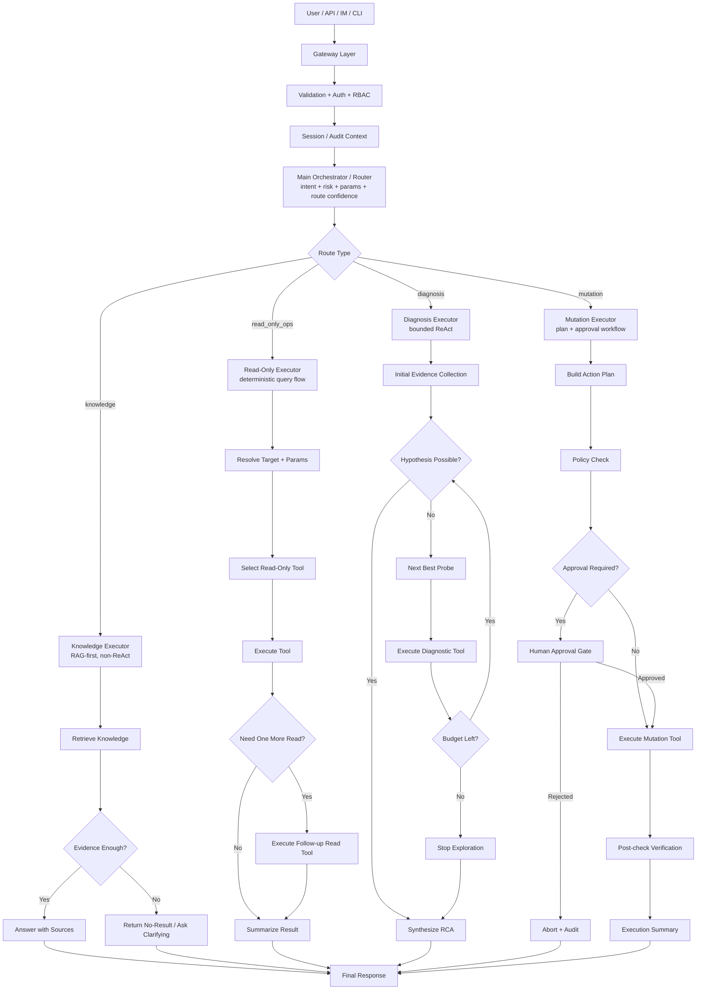
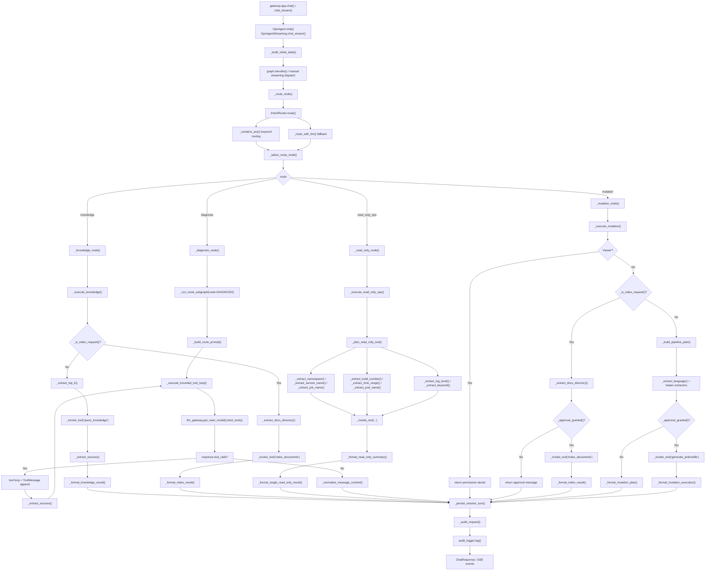
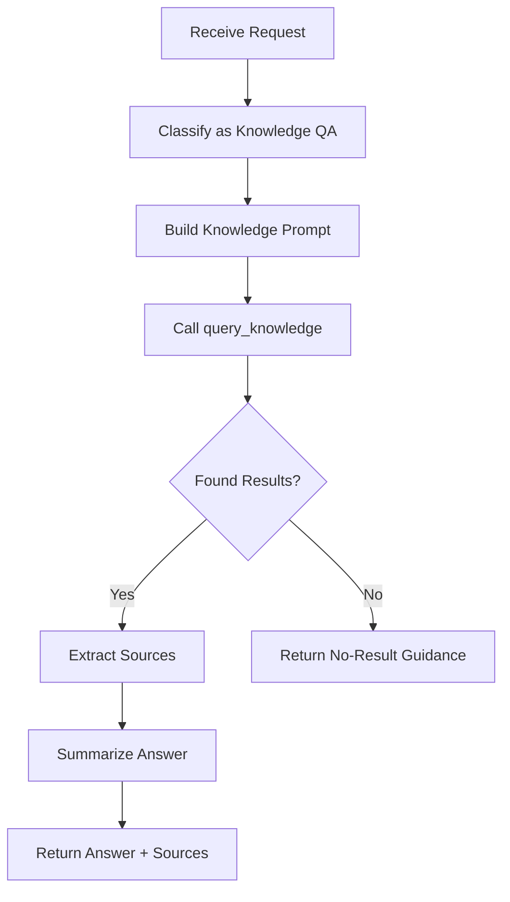
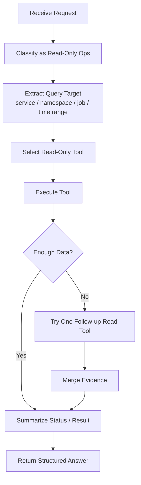
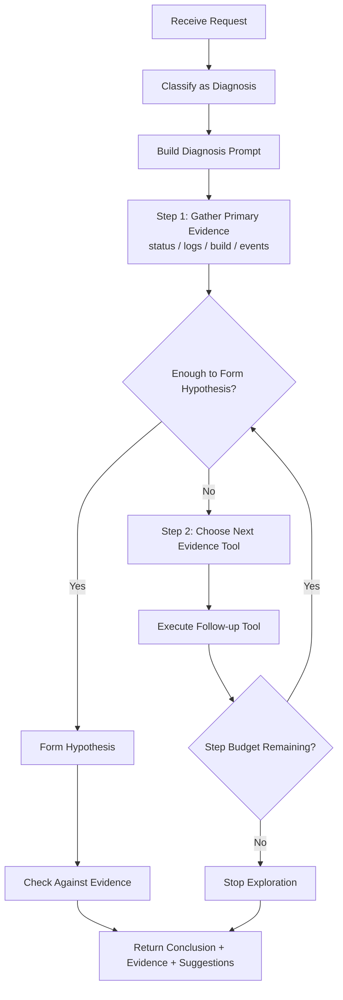
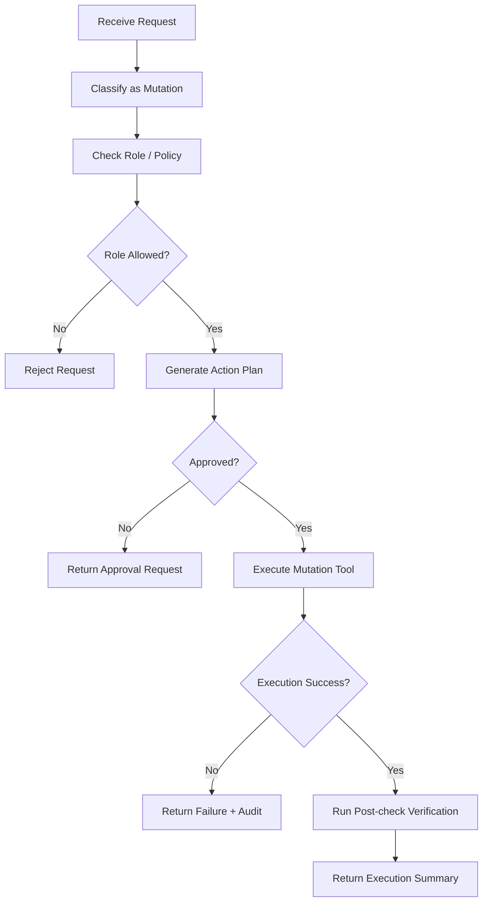

# OpsAgent 推荐架构深度解析

本文档描述 OpsAgent 的推荐版 Agent 架构。目标不是“让所有请求都走 ReAct”，而是把不同任务映射到不同的执行范式：

- `knowledge`：RAG-first，非 ReAct
- `read_only_ops`：确定性查询执行器，非 ReAct
- `diagnosis`：受限 ReAct，限步取证
- `mutation`：计划 + 审批 + 执行 + 回读校验

Shared memory 的结构和权限矩阵见 [shared-memory-design.md](./shared-memory-design.md)。

## 一、推荐版总体控制流



## 二、为什么不是“主 Agent + 所有子路由都 ReAct”

这种系统最容易犯的错，是把所有问题都 agent 化。这样会带来三个问题：

1. 简单查询被复杂化。查 Pod 状态、查构建结果，本来只需要一次工具调用，却被放进多轮推理。
2. 高风险变更失控。变更类任务如果也走自由 ReAct，会把权限、审批和幂等控制交给 prompt。
3. 审计难以闭环。没有明确的路由执行契约时，很难解释“为什么走这条路、为什么用了这个工具、为什么停在这里”。

因此推荐版的关键不是“多 Agent”，而是“路由后使用专用执行器”。

## 三、四条路由的职责和范式

### 3.1 `knowledge`

范式：`RAG-first + constrained synthesis`

目标：
- 从知识库中检索事实
- 输出带来源的回答
- 不调用运维实时查询工具

执行契约：
- 优先调用 `query_knowledge`
- 检索不到就明确说未命中
- 成功标准是“回答有来源”，不是“回答得像”

### 3.2 `read_only_ops`

范式：`deterministic query executor`

目标：
- 对 Jenkins / K8s / 日志系统做只读查询
- 尽量一次命中合适的工具
- 最多做一次补充查询

执行契约：
- 先解析目标实体和参数
- 再选择只读工具
- 最终输出状态摘要

### 3.3 `diagnosis`

范式：`bounded ReAct`

目标：
- 收集证据
- 做有限步的多源排障
- 输出结论、证据、建议动作

执行契约：
- 允许多步工具探索
- 必须设置步数预算
- 必须先证据后结论

### 3.4 `mutation`

范式：`plan -> approval -> execute -> verify`

目标：
- 承载所有有副作用的动作
- 在审批门后执行
- 输出可审计的执行摘要

执行契约：
- 先生成计划
- 做 RBAC 和策略校验
- 未审批时只返回计划，不执行工具
- 执行后必须做回读验证

当前已接入的 mutation 示例：
- Jenkinsfile 生成
- 知识库文档索引

## 四、推荐版代码分层

```
gateway/
  app.py                      # API / SSE / request parsing

agent_core/
  agent.py                    # 主 orchestrator + graph wiring
  router.py                   # 路由决策
  session.py                  # session abstraction
  audit.py                    # 审计与工具轨迹
  schemas.py                  # route / risk / response types

  executors/
    knowledge.py              # RAG executor
    read_only_ops.py          # deterministic query executor
    diagnosis.py              # bounded ReAct executor
    mutation.py               # approval workflow executor
```

当前仓库尚未完全拆到 `executors/` 目录，但推荐设计就是这个方向。

## 五、函数级控制流图

下面这张图对应当前实际代码，而不是理想化概念图。每个节点都落到具体函数。



函数和文件对应关系：

- 主入口与图编排：`agent_core/agent.py`
- 路由策略：`agent_core/router.py`
- 会话：`agent_core/session.py`
- 审计：`agent_core/audit.py`

如果后续把执行器拆文件，推荐映射如下：

- `_execute_knowledge()` -> `agent_core/executors/knowledge.py`
- `_execute_read_only_ops()` -> `agent_core/executors/read_only_ops.py`
- `_run_route_subgraph()` 与 `_execute_bounded_tool_loop()` -> `agent_core/executors/diagnosis.py`
- `_execute_mutation()` -> `agent_core/executors/mutation.py`

## 六、每条路由的推荐状态机

### `knowledge`



### `read_only_ops`



### `diagnosis`



### `mutation`



## 七、实现优先级

建议按以下顺序落地：

1. 先把 `router` 固化成 orchestrator，而不是大一统 ReAct。
2. 把 `knowledge` 和 `read_only_ops` 收紧成确定性执行器。
3. 把 `diagnosis` 作为唯一保留明显 ReAct 味道的路由。
4. 把 `mutation` 做成显式审批工作流。
5. 最后再把 session / audit 持久化到 Redis / DB。
